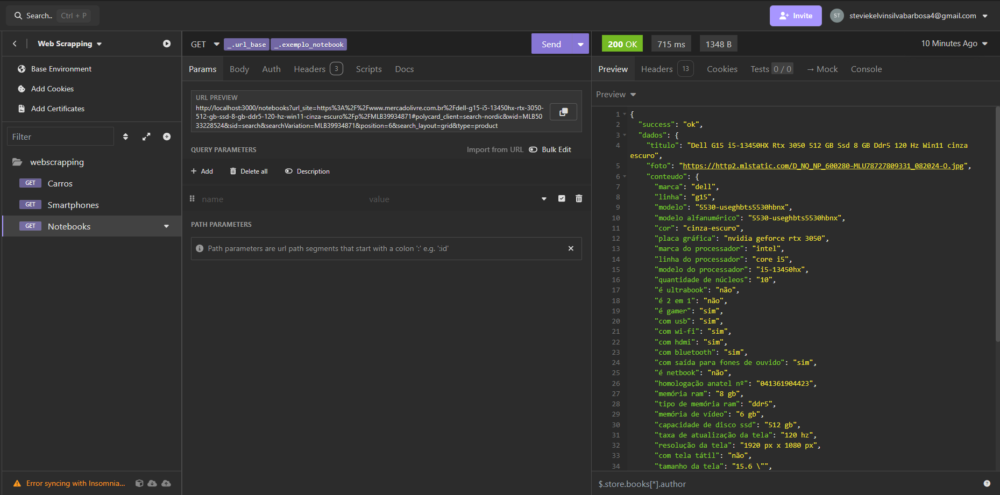

# Web scraping com rails, postgres e docker

## Dependencias para uso

- Docker

## Instalações

  - Clone o projeto em sua maquina
  - Copie o .env-example para .env na raiz do projeto
  - Levante o projeto com o comando `Docker compose up`
  - Importe o modelo insomnia disponível na raiz do projeto
  
Sua aplicação estará rodando em:

  ```bash
  http://localhost:3000
  ```

Rotas disponiveis:

  ```bash
    http://localhost:3000/info
  ```

